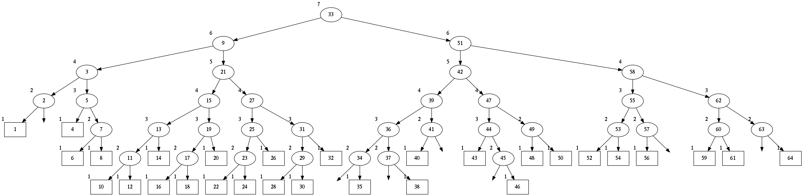

<h2>Table of Contents</h2>

<ul>
<li><a href="#orgheadline1">1. Balanced binary AVL Tree</a></li>
<li><a href="#orgheadline2">2. ToList, Range and Map Extensions</a></li>
<li><a href="#orgheadline3">3. Graphviz Output</a></li>
<li><a href="#orgheadline11">4. Demo</a>
<ul>
<li><a href="#orgheadline4">4.1. Inorder Insertion and Single Rotations</a></li>
<li><a href="#orgheadline5">4.2. Double Rotations</a></li>
<li><a href="#orgheadline6">4.3. Strings</a></li>
<li><a href="#orgheadline7">4.4. Random Insertion</a></li>
<li><a href="#orgheadline8">4.5. Traversal Pre-, Post- and Inorder, Map</a></li>
<li><a href="#orgheadline9">4.6. Sort Performance</a></li>
<li><a href="#orgheadline10">4.7. Range Queries and Range Maps</a></li>
</ul>
</li>
</ul>

# Balanced binary AVL Tree

    using System;
    using System.Collections.Generic; 
    
    public class AVLTree<T> {
    
      public Node root;
      int numElements;
      public delegate int CompareDelegate(T v1, T v2); 
      public readonly CompareDelegate compare = Comparer<T>.Default.Compare; 
    
      public int Count {
        get { return numElements; }
      }
    
      public AVLTree() {
        root = null;
        numElements = 0; 
      }
    
      public AVLTree(CompareDelegate compare) : this() {
        this.compare = compare; 
      }
    
      public void Insert(T value) {
        numElements++; 
        root = (root == null) ? new Node(value, null) : root.Insert(value, compare); 
      }
    
      public Node Find(T value) {
        return root.Find(value, compare);
      }
    
      public class Node {
        public readonly T value;
        Node parent;
        public Node left;
        public Node right;
        public int height;
    
        public Node(T value, Node parent) {
          this.value = value;
          this.parent = parent;
          left = null;
          right = null;
          height = 1;
        }
    
        public Node Insert(T value, CompareDelegate compare) {
          if (compare(value, this.value) < 0) {
            return Insert(ref left, value, compare); 
          } else {
            return Insert(ref right, value, compare); 
          }
        }
    
        private Node Insert(ref Node node, T value, CompareDelegate compare) {
          if (node == null) {
            node = new Node(value, this); 
            return node.Rebalance(); 
          }
          else  
            return node.Insert(value, compare);
        }    
    
        public Node Find(T value, CompareDelegate compare) {
          int cmp = compare(this.value, value);
          if (cmp == 0) return this;
          if (cmp > 0) return left.Find(value,compare);
          return right.Find(value,compare);
        }
    
        private Node Rebalance() {
          Node v = this;
          Node newRoot = this; 
          bool restructured = false; 
          while (v != null) {
            if (!restructured && Math.Abs(ChildHeight(v.left) - ChildHeight(v.right)) > 1) {
              v = Restructure(v);
              restructured = true; 
            }
            v.height = 1 + v.MaxChildHeight();    
            newRoot = v;
            v = v.parent; 
          }
          return newRoot; 
        }
    
        private static int ChildHeight(Node child) {
          return (child == null) ? 0 : child.height;
        }
    
        private int MaxChildHeight() {
          return Math.Max(ChildHeight(left), ChildHeight(right)); 
        }
    
        private Node ChildWithMaxHeight() {
          return (ChildHeight(left) > ChildHeight(right)) ? left : right;
        }    
    
        private Node Restructure(Node z) {
          var y = z.ChildWithMaxHeight();
          var x = y.ChildWithMaxHeight();
          Node a,b,c; 
          Node T1, T2; 
          if (x == y.left && y == z.left) {
            a = x; b = y; c = z; 
            T1 = a.right;
            T2 = b.right;
          } else if (x == y.right && y == z.right) {
            a = z; b = y; c = x; 
            T1 = b.left;
            T2 = c.left;
          } else if (x == y.left && y == z.right) {
            a = z; b = x; c = y; 
            T1 = b.left;
            T2 = b.right;
          } else {
            a = y; b = x; c = z;
            T1 = b.left;
            T2 = b.right;
          }
          if (z.parent != null) {
            if (z == z.parent.left)
              z.parent.left = b;
            else z.parent.right = b; 
          }
          b.parent = z.parent; 
    
          b.left = a;
          a.parent = b;
          b.right = c;
          c.parent = b;
    
          a.right = T1;
          if (T1 != null) T1.parent = a; 
          c.left = T2;
          if (T2 != null) T2.parent = c; 
          a.height = 1 + a.MaxChildHeight();
          b.height = 1 + b.MaxChildHeight();
          c.height = 1 + c.MaxChildHeight();
          return b;
        }        
      }  
    }

-   **`Insert`:** O(log n)
-   **`Find`:** O(log n)

# ToList, Range and Map Extensions

    using System; 
    using System.Collections.Generic; 
    
    static class AVLTreeListExtensions {
    
      public delegate void TraversalDelegate<T>(AVLTree<T>.Node node, CollectDelegate<T> collect); 
      public delegate void CollectDelegate<T>(T value); 
      public delegate int QueryDelegate<T>(T value);
    
      public static List<T> ToList<T>(this AVLTree<T> tree, TraversalDelegate<T> traversalmethod) {
        var list = new List<T>(tree.Count);
        tree.Map(traversalmethod, x => list.Add(x));
        return list;
      }
    
      public static List<T> ToList<T>(this AVLTree<T> tree) {
        return tree.ToList<T>(TraversePreorder<T>);
      }
    
      public static List<T> Range<T>(this AVLTree<T> tree, T minValue, T maxValue) {
        var list = new List<T>();
        tree.MapRange(minValue, maxValue, x => list.Add(x));
        return list; 
      }
    
      public static void Map<T>(this AVLTree<T> tree, TraversalDelegate<T> traversalmethod, CollectDelegate<T> collect) {
        traversalmethod(tree.root, collect);
      }
    
      public static void MapRange<T>(this AVLTree<T> tree, T minValue, T maxValue, CollectDelegate<T> collect) {
        RangeQuery(tree.root, collect, x => tree.compare(x,minValue), x => tree.compare(maxValue, x));
      }
    
      public static TraversalDelegate<T> Preorder<T>(this AVLTree<T> tree) {
        return TraversePreorder<T>; 
      }
    
      public static TraversalDelegate<T> Postorder<T>(this AVLTree<T> tree) {
        return TraversePostorder<T>; 
      }
    
      public static TraversalDelegate<T> Inorder<T>(this AVLTree<T> tree) {
        return TraverseInorder<T>; 
      }
    
      private static void TraversePreorder<T>(AVLTree<T>.Node node, CollectDelegate<T> collect) {
        if (node.left != null) TraversePreorder(node.left, collect);
        collect(node.value); 
        if (node.right != null) TraversePreorder(node.right, collect); 
      }
    
      private static void TraversePostorder<T>(AVLTree<T>.Node node,  CollectDelegate<T> collect) {
        if (node.right != null) TraversePostorder(node.right, collect); 
        collect(node.value);
        if (node.left != null) TraversePostorder(node.left, collect);
      }
    
      private static void TraverseInorder<T>(AVLTree<T>.Node node, CollectDelegate<T> collect) {
        collect(node.value);
        if (node.left != null) TraverseInorder(node.left, collect);
        if (node.right != null) TraverseInorder(node.right, collect); 
      }
    
      private static void RangeQuery<T>(AVLTree<T>.Node node, CollectDelegate<T> collect, QueryDelegate<T> traverseLeft, QueryDelegate<T> traverseRight) { 
        int cmpLeft = traverseLeft(node.value);
        if (cmpLeft > 0 &&  node.left != null) 
          RangeQuery(node.left, collect, traverseLeft, traverseRight);
    
        int cmpRight = traverseRight(node.value); 
        if (cmpLeft > 0 && cmpRight > 0) 
          collect(node.value);
    
        if (cmpRight > 0 && node.right != null)  
          RangeQuery(node.right, collect, traverseLeft, traverseRight);
      }
    }

-   **`ToList`:** O(n)
-   **`Range`:** O(log(n) + s), where 
    -   **s:** number of elements in range

# Graphviz Output

    using System;
    
    public static class AVLTreeExtensions {
    
      private static void PrintNode<T>(T rootValue, T childValue) {
        Console.WriteLine("  \"{0}\" -> \"{1}\"", rootValue, childValue);
      }
    
      private static void PrintNode<T>(T value, int empties) {
        Console.WriteLine("  empty{0} [label=\"\", style=invis];", empties);
        Console.WriteLine("  \"{0}\" -> empty{1}", value,  empties);
      }
    
      private static void PrintSubTree<T>(AVLTree<T>.Node node, ref int empties) {
    
        if (node.left == null && node.right == null) {
          Console.WriteLine("  \"{0}\" [shape=rectangle,xlabel={1}];", node.value,node.height);
          return;
        }
        Console.WriteLine("  \"{0}\" [xlabel={1}];", node.value,node.height);
    
        if (node.left != null) {
          PrintNode(node.value, node.left.value);
          PrintSubTree(node.left, ref empties);
        } else if (node.right != null) {
          PrintNode(node.value, empties++);
        }
    
        if (node.right != null) {
          PrintNode(node.value, node.right.value);
          PrintSubTree(node.right, ref empties);
        } else if (node.left != null) {
          PrintNode(node.value, empties++);
        }
    
      }
    
      public static void PrintDot<T>(this AVLTree<T> tree) {
        Console.WriteLine("digraph G {\n  forcelabels=true;");
        int empties = 0;
        PrintSubTree(tree.root, ref empties); 
        Console.WriteLine("}"); 
      }
    }

# Demo

## Inorder Insertion and Single Rotations

    public class TestAVL {
    
      public static void Main() {
        var avltree = new AVLTree<int>(); 
        for(int i = 15; i > 0; i--)
          avltree.Insert(i); 
    
        avltree.PrintDot(); 
      }
    }

    mcs demo/testdot.cs src/avltreeextensions.cs src/avltree.cs
    mono demo/testdot.exe

## Double Rotations

    public class TestAVL {
    
      public static void Main() {
        var avltree = new AVLTree<int>(); 
        avltree.Insert(1); 
        avltree.Insert(3); 
        avltree.Insert(2); 
        avltree.Insert(5); 
        avltree.Insert(4); 
        avltree.Insert(7); 
        avltree.Insert(6); 
        avltree.Insert(9); 
        avltree.Insert(8); 
        avltree.Insert(11); 
        avltree.Insert(10); 
        avltree.Insert(13); 
        avltree.Insert(12); 
        avltree.Insert(15); 
        avltree.Insert(14); 
        avltree.PrintDot(); 
      }
    }

    mcs demo/testdot2.cs src/avltreeextensions.cs src/avltree.cs
    mono demo/testdot2.exe

## Strings

    public class TestAVL {
    
      public static void Main() {
        var avltree = new AVLTree<string>(); 
        avltree.Insert("Jamie"); 
        avltree.Insert("Tywin"); 
        avltree.Insert("Tyrion"); 
        avltree.Insert("Myrcella"); 
        avltree.Insert("Joffrey"); 
        avltree.Insert("Tommen"); 
        avltree.Insert("Cersei"); 
    
    //    var n = avltree.Find("Tywin");
    //    System.Console.WriteLine("Found: " + n.value); 
    
        avltree.PrintDot(); 
      }
    }

    mcs demo/teststrings.cs src/avltreeextensions.cs src/avltree.cs
    mono demo/teststrings.exe

## Random Insertion

Sibling heights should only differ by 1: 

    using System; 
    using System.Linq; 
    
    public class TestAVL {
    
      public static void Main() {
        var avltree = new AVLTree<int>(); 
        var numbers = Enumerable.Range(1,64).ToList();
        var random = new Random(); 
        while (numbers.Count > 0) {  // we need distinct numbers or my print method will fail
          int nextIndex = random.Next(0, numbers.Count);
          avltree.Insert(numbers[nextIndex]);
          numbers.RemoveAt(nextIndex); 
        }
        avltree.PrintDot(); 
      }
    }

    mcs demo/testrandom.cs src/avltreeextensions.cs src/avltree.cs
    mono demo/testrandom.exe

## Traversal Pre-, Post- and Inorder, Map

    using System; 
    using System.Collections.Generic; 
    
    public class TestTraverse {
    
      public static void Main() {
        var avltree = new AVLTree<int>(); 
        for(int i = 15; i > 0; i--)
          avltree.Insert(i); 
    
        foreach(var i in avltree.ToList())
          Console.Write(i + " "); 
        Console.WriteLine();
        foreach(var i in avltree.ToList(avltree.Postorder()))
          Console.Write(i + " "); 
        Console.WriteLine();
        foreach(var i in avltree.ToList(avltree.Inorder()))
          Console.Write(i + " "); 
    
        Console.WriteLine();
        var doubles = new List<int>();
        avltree.Map(avltree.Preorder(), x => doubles.Add(2*x));
        foreach(var i in doubles)
          Console.Write(i + " ");
      }
    }

    mcs demo/testtraverse.cs src/avltreelistextensions.cs src/avltree.cs
    mono demo/testtraverse.exe

    1 2 3 4 5 6 7 8 9 10 11 12 13 14 15 
    15 14 13 12 11 10 9 8 7 6 5 4 3 2 1 
    8 4 2 1 3 6 5 7 12 10 9 11 14 13 15 
    2 4 6 8 10 12 14 16 18 20 22 24 26 28 30

## Sort Performance

    using System; 
    using System.Linq; 
    using System.Collections.Generic; 
    using System.Diagnostics; 
    
    public class Treesort {
    
      public static void Main() {
    
        int n = 1000000;
        var random = new Random();
        Console.WriteLine("Generating {0} random elements...", n);
        var numbers = Enumerable.Range(0,n).Select(x => random.Next()); 
    
        var T = new AVLTree<int>();
        Console.WriteLine("Sorting {0} random elements...", n); 
        var sw = Stopwatch.StartNew(); 
        foreach(var i in numbers) 
          T.Insert(i); 
        var elapsedInsert = sw.ElapsedMilliseconds;
        T.ToList(); 
        var elapsedToList = sw.ElapsedMilliseconds;
        sw.Stop(); 
        Console.WriteLine("Insertion: {0} ToList: {1} Combined: {2}", elapsedInsert, elapsedToList, elapsedInsert + elapsedToList); 
      }
    }

    mcs demo/treesort.cs src/avltreelistextensions.cs src/avltree.cs
    mono demo/treesort.exe

    Generating 1000000 random elements...
    Sorting 1000000 random elements...
    Insertion: 1108 ToList: 1209 Combined: 2317

## Range Queries and Range Maps

    using System;
    using System.Collections.Generic; 
    
    public class TestRange {
    
      public static void Main() {
        var avltree = new AVLTree<int>(); 
        for(int i = 15; i > 0; i--)
          avltree.Insert(i); 
    
        foreach(var i in avltree.Range(2,14))
          Console.Write(i + " "); 
        Console.WriteLine();
    
        var doubles = new List<int>();
        avltree.MapRange(2,14, x => doubles.Add(2*x));
        foreach (var i in doubles)
          Console.Write(i + " ");
      }
    }

    mcs demo/testrange.cs src/avltreelistextensions.cs src/avltree.cs
    mono demo/testrange.exe

    3 4 5 6 7 8 9 10 11 12 13 
    6 8 10 12 14 16 18 20 22 24 26